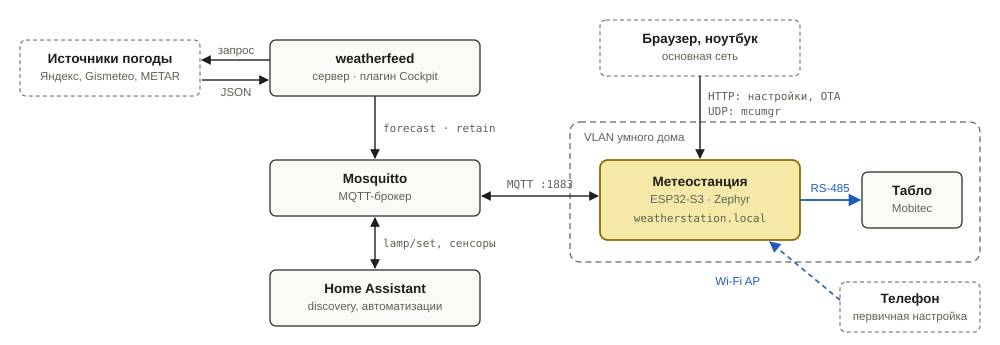
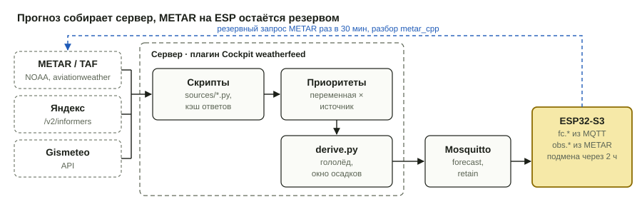

# Метеостанция на табло Mobitec

Уличная погода, прогноз и комнатный климат на автобусном табло Mobitec 102×11 точек. Вторая версия заменяет Raspberry Pi, два Python-скрипта и реле Sonoff одной платой ESP32-S3 под управлением [Zephyr](https://zephyrproject.org/).



## Что делает

- **Показывает погоду.** Набор экранов настраивается в браузере: элементы раскладываются мышью на холсте 102×11, у каждого экрана есть условие показа. Например, «дождь меньше чем через 3 часа», «CO2 выше 1000 ppm» или «после 22:00». Центр экрана постоянный, боковые зоны сменяются раз в минуту, поэтому табло перекладывает за раз только 20–30 столбцов.
- **Меряет климат в комнате.** Датчики BME280 (температура, влажность, давление) и MH-Z19B (CO2).
- **Управляет подсветкой.** Люминесцентная лампа табло на 24 В включается по MQTT.
- **Работает с Home Assistant.** Датчики, подсветка и выбор экрана появляются в HA сами через MQTT discovery.
- **Обновляется по сети.** MCUboot, OTA с откатом на предыдущую прошивку, если новая не смогла подключиться к брокеру.

## Откуда берётся прогноз



Прогноз собирает сервис weatherfeed на домашнем сервере. Его интерфейс — плагин [Cockpit](https://cockpit-project.org/): в нём редактируются Python-скрипты источников (Яндекс, Gismeteo, METAR/TAF) и таблица приоритетов, по которой выбирается значение каждой переменной. Если источник отвалился, значение берётся из следующего. Готовый прогноз уходит в MQTT с флагом retain.

Если сервер молчит дольше двух часов, ESP показывает погоду по сводке METAR ближайшего аэропорта. Сводку станция запрашивает сама и разбирает библиотекой [metar_cpp](https://github.com/radiolok/metar_cpp).

## Структура репозитория

| Папка | Что внутри |
| --- | --- |
| [`hw/`](hw/) | Аппаратная часть: структурная схема, распиновка, питание, ключ подсветки, модули для макетки |
| [`fw/`](fw/) | Прошивка ESP32-S3 на Zephyr: архитектура, конструктор экранов, протокол табло, OTA |
| [`server/weatherfeed/`](server/weatherfeed/) | Сервис прогноза для домашнего сервера с плагином Cockpit |
| [`au/`](au/) | Сборочные единицы — внешние репозитории, подключённые как git submodules |
| [`tools/sign-simulator/`](tools/sign-simulator/) | Симулятор табло 102×11 в браузере: шрифты, иконки, варианты экранов, кодирование кадра |
| [`legacy/rpi/`](legacy/rpi/) | Первая версия на Raspberry Pi: Python-скрипты, иконки, шрифт |
| [`docs/`](docs/) | Общие схемы и [ТЗ на конструктор экранов](docs/screen-constructor.md) |

Клонировать вместе с сабмодулями:

```sh
git clone --recursive https://github.com/radiolok/weatherstation.git
```

## Основные решения

| Что | Решение |
| --- | --- |
| Контроллер | ESP32-S3-DevKitC-1U N16R8, внешняя антенна через U.FL → RP-SMA |
| ОС | Zephyr, MCUboot, первая прошивка по USB, дальше OTA |
| Табло | Mobitec, RS-485, 4800 8N1, только передача. Кадр отправляется целиком, табло само перекладывает только изменившиеся точки |
| Шрифты | Свои: цифры 6×11 и мелкий 3×5. Встроенные шрифты табло не используются |
| Датчики | BME280 по I²C, MH-Z19B по UART |
| Подсветка | Лампа 24 В / 1.5 А, ключ в разрыве +24 В |
| Сеть | Wi-Fi в VLAN умного дома, MQTT без TLS, Home Assistant discovery, NTP |
| Настройка | Веб-страница на устройстве; при зажатой кнопке — точка доступа со списком сетей |

## Состояние

- [x] Первая версия на Raspberry Pi ([`legacy/rpi`](legacy/rpi/))
- [x] Аппаратная архитектура и распиновка
- [x] Архитектура прошивки и техническое задание на конструктор экранов
- [x] Разбор недавней погоды, состояния ВПП и QFE в metar_cpp (ветка `runway-state-recent-weather`)
- [x] Прошивка на Zephyr 4.3, фазы F0–F10 без железа: табло, датчики, кнопка и подсветка, Wi-Fi и NTP, MQTT и Home Assistant, конструктор экранов и веб-страница, резерв METAR, MCUboot и OTA, watchdog ([отчёт](fw/docs/implementation-report.md))
- [ ] Проверки на железе H1–H19 ([план](fw/docs/implementation-plan.md#проверки-на-железе))
- [ ] weatherfeed для Cockpit

## Лицензия

[BSD 3-Clause](LICENSE)
