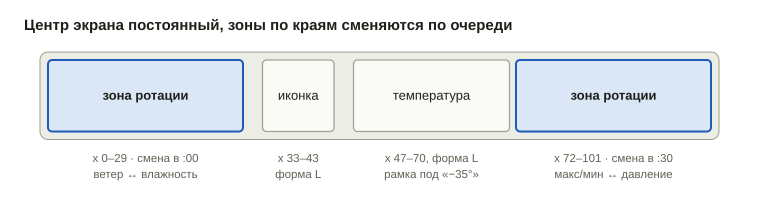
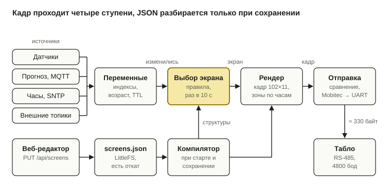

# ТЗ: конструктор экранов метеостанции

Версия от 2 октября 2026.

## 1. Назначение

Конструктор позволяет собирать экраны табло 102×11 из готовых элементов и задавать условия их показа прямо в браузере, без перепрошивки. Веб-страницу отдаёт сама ESP32-S3, конфигурация хранится в устройстве, решение о том, какой экран показать, принимается на устройстве.

Цели:

- на табло всегда то, что важно сейчас: обычная погода, скорый дождь, гололёд, душно в комнате, вечер дома;
- минимум перекладок точек: экран меняется только по условию, внутри экрана меняются лишь зоны ротации;
- новый экран собирается и проверяется за несколько минут, результат в редакторе совпадает с табло до точки.

Входит в версию 1: редактор экранов, редактор правил, симулятор, хранение, импорт и экспорт, исполнение на устройстве, API.

Не входит в версию 1: рисование произвольных пикселей прямо на холсте экрана (для этого есть свои пиктограммы), произвольные формулы и скрипты, анимация, несколько табло на одном устройстве.

## 2. Термины

| Термин | Значение |
| --- | --- |
| Холст | Поле 102×11 точек. Координаты: x 0–101 слева направо, y 0–10 сверху вниз |
| Переменная | Именованное значение с типом, единицей и временем обновления: `out.t`, `fc.rain_in`, `in.co2` |
| Тип элемента | Встроенный в прошивку способ нарисовать данные: «температура», «ветер», «график» |
| Форма | Вариант размера элемента: крупная L (высота 11), мелкая S (одна строка высотой 5), двойная S2 (две строки по 5) |
| Элемент | Экземпляр типа на экране: тип, форма, переменная, рамка (x, y, w, h), выравнивание, параметры |
| Зона ротации | Рамка на экране, в которой по очереди показываются несколько элементов с заданным периодом |
| Экран | Набор элементов и зон ротации на холсте плюс правило показа |
| Правило | Условие, приоритет и тайминги, при которых экран попадает на табло |
| Экран по умолчанию | Единственный экран без условия, показывается, когда ни одно правило не сработало |
| Конфигурация | Все экраны и правила одним JSON-файлом |

## 3. Переменные

Элементы и правила работают только с переменными из этой таблицы. У каждой переменной есть признак достоверности: переменная без значения или старше своего срока жизни считается неизвестной.

| Переменная | Тип, единица | Источник | Обновление |
| --- | --- | --- | --- |
| `out.t` | число, °C | прогноз, факт | 30–40 мин |
| `out.cond` | код иконки: clear, pcloud, cloudy, rain, snow, storm… | прогноз | 30–40 мин |
| `out.wind`, `out.wind_dir` | м/с; n, ne, e… | прогноз | 30–40 мин |
| `out.rh`, `out.p` | %, мм рт. ст. | прогноз | 30–40 мин |
| `fc.tmax`, `fc.tmin` | °C, ближайшие 16 ч | сервер | 30–40 мин |
| `fc.rain_from`, `fc.rain_to` | час суток | сервер | 30–40 мин |
| `fc.rain_in` | минут до начала осадков, 0 = идут сейчас | ESP, из `fc.rain_from` и часов | 1 мин |
| `fc.snow`, `fc.ice`, `fc.storm` | да/нет, ближайшие 12 ч | сервер | 30–40 мин |
| `fc.next` | следующая часть суток: имя, t, иконка | сервер | 30–40 мин |
| `fc.hours` | 12 пар «температура, вероятность осадков»; в тарифе Яндекса нет, нужен другой источник | сервер | 30–40 мин |
| `fc.age` | минут с момента формирования прогноза | ESP | 1 мин |
| `in.t`, `in.rh`, `in.p` | °C, %, мм рт. ст. | BME280 | 30 с |
| `in.p_trend` | изменение давления за 3 ч, мм | ESP | 10 мин |
| `in.co2` | ppm | MH-Z19B | 30 с |
| `time.hour`, `time.min`, `time.dow` | час, минута, день недели 1–7 | SNTP | 1 мин |
| `sun.up` | да/нет | ESP, расчёт по координатам из настроек | 1 мин |
| `sys.lamp`, `sys.mqtt`, `sys.wifi_rssi` | да/нет, да/нет, дБм | ESP | по событию |
| `ext.1` … `ext.8` | число или строка | любой MQTT-топик из настроек | по сообщению |

Внешние переменные `ext.*` настраиваются на веб-странице: имя, топик, поле JSON, единица, срок жизни. Так на табло можно вывести любой датчик из Home Assistant без перепрошивки. Расчёт `fc.snow`, `fc.ice`, `fc.storm` остаётся на сервере: он сводит прогноз Яндекса с METAR и TAF ближайшего аэропорта, и логику можно менять без прошивки.

### Время

Источник для `time.*` и `sun.up` — встроенный NTP-клиент (SNTP из Zephyr). Настройки на странице устройства:

| Поле | Значение | По умолчанию |
| --- | --- | --- |
| NTP-сервер 1 | IP-адрес или имя | адрес из DHCP (опция 42), если есть |
| NTP-сервер 2 | запасной, необязательно | — |
| Интервал синхронизации | 5–1440 мин | 60 мин |
| Часовой пояс | строка POSIX TZ | `MSK-3` |

Пока время не получено хотя бы один раз, `time.*` и `sun.up` неизвестны: правила с окном времени не срабатывают, часы рисуют «--:--». На странице статуса видны время последней успешной синхронизации и сервер, с которого оно получено.

## 4. Каталог элементов

Типы элементов зашиты в прошивку, и конструктор только расставляет их и задаёт параметры. Шрифты: крупные цифры 6×11 со штрихом 2 точки и мелкий 3×5 (цифры, заглавная кириллица, знаки). Иконки бывают 11×11 и 5×5.

| Тип | Крупная L | Мелкая S / двойная S2 | Параметры |
| --- | --- | --- | --- |
| Температура | «+12°» цифрами 6×11 | «+12°» 3×5 | переменная, знак «+», десятые, значок ° |
| Иконка погоды | 11×11 | 5×5 | `out.cond` или `fc.next` |
| Число | цифрами 6×11 | 3×5 | переменная, формат, префикс и суффикс, пиктограмма слева |
| Осадки | зонт 11×11 и «15–19» | S: «☂ 15Ч»; S2: «☂ 15Ч / ДО 19Ч» | что писать, если осадков нет |
| Ветер | — | S: стрелка + «5»; S2: + «М/С» | стрелка «куда» или «откуда» |
| Макс/мин | — | S2: «↑+4 / ↓−7» | горизонт 8, 12 или 16 ч |
| Давление | — | S: стрелка тренда + «748»; S2: + «ММ» | порог тренда, мм за 3 ч |
| Влажность | — | капля + «41%» | переменная |
| CO2 | «1240» цифрами 6×11 | S2: «CO2 / 1240» | порог инверсии, по умолчанию 1000 |
| График | высота 11, ширина 24–60 | — | часов 2–12, пунктир 0°, полоски осадков |
| Часы | «21:40» цифрами 6×11 | «21:40» 3×5 | обновление раз в минуту |
| Текст | — | строка до 20 символов | текст; для полноты, на заводских экранах не используется |
| Пиктограмма | 11×11 | 5×5 | из библиотеки: дом, зонт, капля, снежинка, «!», каток, окно, нет связи, машина юзом |
| Разделитель | вертикаль, 11 точек | — | сплошной или пунктир |
| Зона ротации | контейнер | контейнер | список до 8 элементов, период, сдвиг, см. раздел 5 |

Ширина рамки элемента не зависит от текущего значения. По умолчанию это ширина самого длинного значения (для температуры L это «−35°»), значение выравнивается внутри рамки влево, по центру или вправо. Так смена «−9°» на «−10°» не наезжает на соседний элемент. Если значение неизвестно, элемент рисует «--».

## 5. Экран и зоны ротации

Экран — это холст 102×11, на котором стоят постоянные элементы и зоны ротации. Постоянные элементы перерисовываются только при смене значения, зона ротации перелистывает свои элементы по таймеру.



Зоны ротации (выделены цветом) меняются раз в минуту со сдвигом 30 с, поэтому за одну смену переворачивается не больше 30 столбцов. Иконка и температура перерисовываются, только когда меняется погода.

Размещение:

- по x шаг 1 точка;
- по y форма L и S2 стоят только в y = 0, форма S ставится в y = 0, 3 или 6 (верхняя строка, центр, нижняя строка);
- рамки не перекрываются и не выходят за холст. Редактор подсвечивает конфликт и не даёт сохранить такой экран;
- до 12 элементов и до 4 зон ротации на экран.

Зона ротации:

- рамка x, y, w, h и список до 8 элементов, каждый из которых целиком помещается в рамку;
- период смены от 15 до 3600 с, по умолчанию 60 с;
- сдвиг внутри периода, чтобы зоны менялись не одновременно. Редактор предлагает равный разнос: для двух зон с периодом 60 с это 0 и 30 с;
- смена привязана к часам, а не к моменту показа экрана. После возврата на экран зона продолжает с того элемента, который положен по текущему времени;
- элемент с неизвестным значением или с пометкой «пропускать, если пусто» (например, «Осадки» без осадков) из очереди выпадает.

Условие на элемент:

- у любого элемента, в том числе внутри зоны ротации, может быть условие показа `when`: до 4 сравнений в том же формате, что и в правилах экрана, с гистерезисом;
- у элемента может быть до 3 вариантов подмены `alts` в той же рамке, каждый со своим условием. Рисуется первый вариант с истинным условием, иначе сам элемент;
- если условие ложно и подходящего варианта нет, рамка остаётся пустой, а в зоне ротации элемент выпадает из очереди;
- пример: на «Обычном» экране у иконки погоды вариант `{"type": "picto", "name": "skid", "when": {"all": [{"var": "fc.ice", "op": "=", "val": true}]}}`, и при гололёде вместо облака показывается «машина юзом».

Рамка одна на элемент и все его варианты, поэтому проверка перекрытий не усложняется: вариант обязан помещаться в рамку основного элемента.

Свойства экрана: имя, признак «по умолчанию», правило показа (раздел 6), включён или отключён.

## 6. Правила выбора экрана

На табло выводится активный экран с наибольшим приоритетом, а если активных нет, то экран по умолчанию. Условия проверяются раз в 10 с и при каждом изменении переменных.

### Поля правила

| Поле | Значение | По умолчанию |
| --- | --- | --- |
| Условие | Группа «все» или «любое» из сравнений, один уровень вложенности | — |
| Сравнение | Переменная, операция (=, ≠, <, ≤, >, ≥, между, из списка), значение, гистерезис | гистерезис 0 |
| Окно времени | С … до … (через полночь тоже), дни недели | круглосуточно |
| Приоритет | 1–99, больше значит важнее | 50 |
| Задержка включения | Условие должно держаться столько секунд подряд | 0 с |
| Задержка выключения | Экран остаётся активным столько секунд после того, как условие стало ложным | 0 с |
| Минимальное время показа | Экран не снимается раньше, даже если условие стало ложным | 300 с |
| Режим | «пока активен» или «вставка»: показывать N секунд раз в M минут, пока условие истинно | «пока активен» |

Гистерезис работает так: при условии «`in.co2` > 1000, гистерезис 100» экран включается выше 1000 ppm, а выключается ниже 900. Сравнение с неизвестной переменной всегда ложно.

### Алгоритм выбора

1. Для каждого включённого экрана проверить окно времени и условие с учётом гистерезиса и задержек. Экраны с истинным условием становятся кандидатами.
2. Взять кандидата с наибольшим приоритетом. При равенстве выигрывает тот, кто выше в списке экранов. Кандидатов нет — экран по умолчанию.
3. Если победитель совпадает с текущим экраном, ничего не менять.
4. Если приоритет победителя выше текущего, переключиться сразу: важное не ждёт.
5. Иначе переключиться, только когда текущий экран перестал быть активным и его минимальное время показа истекло.
6. Опубликовать в MQTT текущий экран и причину выбора: какое сравнение сработало и на каком значении.

### Ручное управление

Экран можно закрепить на N минут или до отмены из веб-интерфейса, по MQTT или из Home Assistant. Закреплённый экран стоит выше любого правила. Команда «Авто» возвращает выбор по правилам.

Отладочная кнопка на корпусе: короткое нажатие закрепляет следующий по списку экран, включая отключённые, по кругу, без проверки условий. Через 60 с без нажатий табло возвращается к автовыбору. Долгое нажатие (5 с) по-прежнему включает точку доступа.

## 7. Веб-конструктор

Конструктор — это раздел «Табло» веб-интерфейса устройства, закрытый тем же паролем. Все правки делаются в браузере и попадают в устройство только по кнопке «Сохранить».

### Список экранов

- Карточка на каждый экран: миниатюра с текущими данными, имя, правило одной строкой («До дождя ≤ 3 ч, 06:00–23:00, приоритет 50»), переключатель «включён».
- Отметка на экране, который сейчас на табло, и причина выбора.
- Порядок меняется перетаскиванием. Кнопки «Создать», «Дублировать», «Удалить», «Сделать экраном по умолчанию».

### Редактор экрана

- В центре холст 102×11 в виде точек табло с масштабом 6–12 пикселей на точку, линейка с координатами.
- Слева палитра типов элементов, сгруппированная по источникам: «Улица», «Прогноз», «Дома», «Время», «Оформление». У каждого типа показаны его формы L / S / S2 с размером в точках.
- Элемент перетаскивается из палитры на холст или в зону ротации. При перетаскивании показана рамка, привязка к допустимым y и к краям соседних рамок, красная подсветка при перекрытии.
- Выбранный элемент сдвигается стрелками на 1 точку, удаляется клавишей Delete. Форма меняется в панели свойств без пересоздания элемента.
- Справа панель свойств: переменная, форма, x, y, ширина рамки, выравнивание, параметры типа. Для зоны ротации: список элементов с перетаскиванием, период, сдвиг. Для любого элемента: условие показа и варианты подмены; кнопки над холстом переключают, какой вариант нарисован.
- Зона ротации показывает один элемент, а стрелки над ней листают остальные.
- Холст рисуется по текущим значениям устройства. Режим «Худший случай» подставляет самые длинные значения («−35°», «25» м/с, «2000» ppm), чтобы проверить, что всё помещается.
- Кнопка «Показать на табло» выводит редактируемый экран на 60 с без сохранения.
- Отмена и повтор (Ctrl+Z, Ctrl+Y) в пределах сеанса.

### Редактор правила

- Конструктор строк: «\[переменная\] \[операция\] \[значение\] гистерезис \[число\]», переключатель «все / любое», одна вложенная группа.
- Список переменных показывает единицу и текущее значение. Для переменных с фиксированным набором значений (`out.cond`, да/нет) значение выбирается из списка.
- Рядом с каждой строкой индикатор «сейчас истинно / ложно / нет данных».
- Поля окна времени, приоритета, задержек, минимального времени показа и режима. Ниже итог обычными словами.

### Симулятор

- Ползунки и списки для всех переменных и времени суток. Показывает, какой экран был бы выбран и почему, и сам экран.
- «Прогон суток»: по текущему прогнозу строит ленту на 24 часа с шагом 10 минут: какой экран в какое время и сколько точек перевернётся за сутки.

### Редактор пиктограмм

- Сетка 11×11 или 5×5 в виде точек табло, та же отрисовка, что и у холста. Левая кнопка и протяжка зажигают точки, правая гасит.
- Кнопки: инверсия, сдвиг на 1 точку, отражение, поворот на 90°, очистка.
- Рядом предпросмотр в реальном масштабе и в составе выбранного экрана.
- Импорт картинки (PNG, SVG) с уменьшением и порогом по яркости, дальше дорисовка руками.
- Встроенные пиктограммы и иконки погоды можно скопировать и перерисовать. Своя версия с тем же именем заменяет встроенную, «Сбросить» возвращает оригинал.
- Хранение: раздел `pictos` в том же JSON — имя (латиница), размер и битовая маска по строкам в hex (11×11 — 11 слов по 16 бит). До 32 своих пиктограмм, они попадают в палитру и в ответ `/api/glyphs`.
- Пиктограмму, которая используется на экранах, нельзя удалить: редактор показывает, где она занята.

### Файлы

- Экспорт и импорт всей конфигурации или одного экрана в JSON.
- «Вернуть предыдущую версию»: устройство хранит одну предыдущую конфигурацию.
- «Сбросить к заводскому набору» возвращает набор из раздела 12.

## 8. Формат конфигурации

Вся конфигурация — один JSON-файл со схемой версии 1. Он хранится в LittleFS (`/cfg/screens.json` и `/cfg/screens.prev.json`). Под LittleFS выделяется раздел 1 МБ из свободных 7.9 МБ флеша.

```json
{
  "schema": 1,
  "screens": [
    {
      "id": "main", "name": "Обычный", "default": true, "enabled": true,
      "items": [
        { "type": "rotator", "x": 0, "y": 0, "w": 30, "h": 11, "period": 60, "offset": 0,
          "items": [ { "type": "wind", "form": "S2" },
                     { "type": "humidity", "form": "S", "var": "out.rh", "y": 3 } ] },
        { "type": "icon", "form": "L", "var": "out.cond", "x": 33, "y": 0 },
        { "type": "temp", "form": "L", "var": "out.t", "x": 47, "y": 0, "w": 24, "align": "left", "plus": true },
        { "type": "rotator", "x": 72, "y": 0, "w": 30, "h": 11, "period": 60, "offset": 30,
          "items": [ { "type": "range", "form": "S2", "hours": 16, "align": "right" },
                     { "type": "pressure", "form": "S2", "align": "right" } ] }
      ]
    },
    {
      "id": "rain", "name": "Дождь скоро", "enabled": true,
      "rule": {
        "all": [ { "var": "fc.rain_in", "op": "<=", "val": 180, "hyst": 15 } ],
        "time": { "from": "06:00", "to": "23:00", "days": [1,2,3,4,5,6,7] },
        "prio": 50, "on_delay": 0, "off_delay": 600, "min_show": 300, "mode": "while"
      },
      "items": [ "…" ]
    }
  ],
  "ext": [ { "id": "ext.1", "name": "Балкон", "topic": "zigbee2mqtt/balcony", "field": "temperature", "unit": "°C", "ttl": 3600 } ]
}
```

Ограничения:

| Что | Не больше |
| --- | --- |
| Экранов | 16 |
| Элементов на экране, включая содержимое зон | 12 + по 8 в каждой зоне |
| Зон ротации на экране | 4 |
| Сравнений в правиле | 8 |
| Внешних переменных | 8 |
| Размер файла | 32 КБ |

Устройство проверяет файл целиком до записи: схема, известные типы и переменные, перекрытия рамок, ровно один экран по умолчанию, лимиты. Ошибка возвращается с указанием пути (`screens[1].items[3]: перекрывает items[2]`), и такая конфигурация не применяется. В поле `id` экрана допустимы латиница, цифры и `_`, оно используется в MQTT и Home Assistant.

## 9. Исполнение на ESP32

Модуль display из проекта заменяется конвейером из пяти частей: хранилище переменных, компилятор конфигурации, выбор экрана, рендер, отправка кадра. Строки JSON разбираются только при загрузке и сохранении, в работе никакого интерпретатора нет.



Верхний ряд работает постоянно, нижний срабатывает только при старте и сохранении. Выбор экрана и рендер работают с уже разобранными структурами.

- **Хранилище переменных (vars).** Таблица с фиксированными индексами: значение, время обновления, срок жизни. Заполняется подписчиками zbus на каналах sensors, forecast, net и на внешних топиках. При любом изменении поднимает флаг «данные изменились».
- **Компилятор конфигурации.** Превращает JSON в массивы структур: имена переменных заменяются индексами, типы элементов указателями на функции отрисовки, условия плоским списком сравнений с состоянием гистерезиса. Новая версия собирается в соседнем буфере и подменяется атомарно, без перезагрузки. Объём в RAM до 16 КБ.
- **Выбор экрана.** `k_work_delayable` раз в 10 с и по флагу «данные изменились». Реализует алгоритм из раздела 6, публикует текущий экран и причину в канал display\_state.
- **Рендер.** Рисует выбранный экран в кадровый буфер 102×11 (1122 бита). Зоны ротации выбирают элемент по часам: номер = ((секунда суток − сдвиг) / период) mod число элементов, без пропущенных. Время рендера до 5 мс.
- **Отправка.** Кадр сравнивается с предыдущим. Изменился — кодируется в Mobitec и уходит в UART1 сразу. Не изменился — повторяется раз в 30 с, чтобы табло восстановилось после пропадания питания. Число перевёрнутых точек считается и публикуется для статистики.

Резервный путь: если файл конфигурации повреждён или не проходит проверку, загружается предыдущая версия, а за ней заводской набор, вшитый в прошивку. Табло никогда не остаётся пустым.

Одинаковая картинка в браузере и на табло: шрифты и иконки генерируются из одного исходника в C-заголовок и в JSON для страницы. Функции отрисовки элементов написаны дважды (C и JS). Их совпадение проверяет тест на наборе эталонных экранов: native\_sim и Node рисуют одни и те же данные, битовые карты должны совпасть. Для окончательной проверки редактор может запросить кадр у устройства через `/api/render`.

## 10. API

Устройство — единственный источник конфигурации. MQTT используется для статуса, ручного управления и резервной копии. Топик `ws/<id>/display/cfg` со списками слотов из проекта заменяется на описанные ниже.

### REST (все запросы с паролем)

| Запрос | Назначение |
| --- | --- |
| `GET /api/screens` | Текущая конфигурация |
| `PUT /api/screens` | Проверить, сохранить и применить. Ответ `200` или `422` со списком ошибок и путями |
| `POST /api/screens/validate` | Только проверка, без сохранения |
| `POST /api/screens/rollback` | Вернуть предыдущую версию |
| `GET /api/catalog` | Типы элементов, формы, размеры, параметры, допустимые переменные |
| `GET /api/glyphs` | Шрифты и иконки для рендера в браузере |
| `GET /api/vars` | Текущие значения всех переменных с возрастом |
| `GET /api/display/state` | Текущий экран, причина, активные кандидаты, закрепление |
| `POST /api/render` | Экран + набор значений → кадр 102×11 в base64, рисует прошивка |
| `POST /api/display/preview` | Показать переданный экран на табло N секунд (до 300) |
| `POST /api/display/pin` | `{screen, minutes}` закрепить, `{screen: null}` вернуть автовыбор |

### MQTT

| Топик | Направление | Содержимое | Retain |
| --- | --- | --- | --- |
| `ws/<id>/display/state` | ESP → | `{screen, name, reason, pinned, flips_24h}` при каждой смене | да |
| `ws/<id>/display/pin` | → ESP | `{screen, minutes}` или `auto` | нет |
| `ws/<id>/display/cfg` | ESP → | полная конфигурация после каждого сохранения, резервная копия в брокере | да |
| `ws/<id>/display/cfg/set` | → ESP | полная конфигурация, проходит ту же проверку, что и `PUT` | нет |

В Home Assistant через discovery появляется сущность `select` «Экран табло» с вариантами «Авто» и именами экранов. При каждом сохранении конфигурации список вариантов публикуется заново.

### Дополнения к прогнозу с сервера

В JSON топика `ws/<id>/forecast` добавляются поля, нужные правилам:

```json
{
  "now":  { "t": -2, "cond": "pcloud", "wind": 5, "dir": "nw", "rh": 78, "p": 748 },
  "flags": { "snow": false, "ice": true, "storm": false },
  "next": { "name": "ночь", "t": -7, "cond": "night" }
}
```

## 11. Нефункциональные требования

| Требование | Значение |
| --- | --- |
| Точность предпросмотра | Предпросмотр в браузере совпадает с табло до точки на всех эталонных экранах |
| Применение конфигурации | Не больше 1 с после «Сохранить», без перезагрузки |
| Реакция на условие | Не больше 10 с плюс задержка включения правила |
| Тишина табло | Вне смены экрана каждая зона меняется не чаще своего периода (не менее 15 с), постоянные элементы — только при смене значения |
| Надёжность | Некорректная конфигурация никогда не применяется. При сбое чтения работает предыдущая или заводская |
| Работа без сети | Без брокера и прогноза правила продолжают работать на локальных датчиках и часах |
| Страница | Без фреймворков и внешних CDN, gzip не больше 80 КБ, первая отрисовка быстрее 2 с по Wi-Fi |
| Браузеры | Актуальные Chrome, Firefox, Safari. Перетаскивание через Pointer Events (мышь и планшет). На телефоне достаточно просмотра, правил и свойств |
| Память | Скомпилированная конфигурация до 16 КБ RAM, два буфера. Разбор JSON до 40 КБ на время сохранения |
| Износ флеша | Запись только по «Сохранить» и команде из MQTT, не чаще раза в 5 с |
| Доступ | Тот же пароль, что и на остальные настройки. Изменяющие запросы только POST/PUT |

## 12. Заводской набор экранов

Набор вшит в прошивку и служит одновременно стартовой точкой и примером. Приоритеты расставлены так, чтобы предупреждения перекрывали повседневное.

| Экран | Когда показывается | Приоритет | Слева | В центре | Справа |
| --- | --- | --- | --- | --- | --- |
| Душно | `in.co2` > 1000, гистерезис 100, задержка включения 120 с, 07:00–23:00 | 70 | домик 11×11 | CO2 крупно | пиктограмма «окно» 11×11 |
| Дождь скоро | `fc.rain_in` ≤ 180 мин, гистерезис 15, 06:00–23:00 | 50 | осадки S2 | иконка + `out.t` крупно | график 12 ч |
| Вечер дома | 22:00–07:00 | 30 | домик 11×11 | `in.t` крупно | ротация: `in.rh`, CO2, `out.t` мелко |
| Нет прогноза | `fc.age` > 120 мин и METAR старше 90 мин | 20 | домик 11×11 | `in.t` крупно | пиктограмма «нет связи» 11×11 |
| Обычный | по умолчанию | — | ротация: ветер, `out.rh` | иконка + `out.t` крупно; при `fc.ice` вместо иконки «машина юзом» | ротация: макс/мин, давление |

У всех экранов, кроме «Душно», минимальное время показа 300 с. У «Душно» — 60 с, чтобы после проветривания табло быстро вернулось к погоде. Вечером до 23:00 предупреждение о дожде выигрывает у экрана «Вечер дома», после 23:00 оно уже не срабатывает.

## 13. Этапы и приёмка

Конструктор заменяет этап «Прогноз и слоты» в плане проекта. Этапы ниже идут после того, как работают табло, датчики и MQTT.

1. **Движок без интерфейса.** Хранилище переменных, компилятор конфигурации, элементы, зоны ротации, выбор экрана. Заводской набор вшит в прошивку. Генератор шрифтов и тест совпадения C и JS.
2. **Хранение и API.** LittleFS, проверка, откат, REST и MQTT из раздела 10, `select` в Home Assistant.
3. **Редактор экрана.** Палитра, перетаскивание, привязки, свойства, зоны ротации, «показать на табло», редактор пиктограмм.
4. **Редактор правил и симулятор.** Включая прогон суток по прогнозу.
5. **Внешние переменные.** `ext.1`…`ext.8` из любых MQTT-топиков.

Резерв METAR на ESP (раздел 14) делается после этапа 2: ему нужны только хранилище переменных и HTTPS. Плагин Cockpit ведётся отдельным проектом параллельно.

### Критерии приёмки

- [ ] Заводской набор работает сутки без вмешательства, в `display/state` видны все смены и их причины.
- [ ] Экран «Дождь скоро» появляется в течение 10 с после публикации тестового прогноза с дождём через 2 часа.
- [ ] CO2, колеблющийся между 980 и 1020 ppm, не вызывает мигания экрана «Душно».
- [ ] Новый экран с тремя элементами и правилом собирается с нуля за 5 минут без документации.
- [ ] Предпросмотр в браузере и `/api/render` совпадают до точки на всех эталонных экранах.
- [ ] Конфигурация с перекрытием рамок или неизвестной переменной отклоняется с понятной ошибкой, табло продолжает работать.
- [ ] После порчи файла конфигурации устройство стартует на предыдущей или заводской версии.
- [ ] Выбор экрана в Home Assistant закрепляет его на табло, «Авто» возвращает выбор по правилам.

## 14. Источники прогноза

Основной источник — сервис weatherfeed на сервере с интерфейсом в Cockpit. Резервный — METAR, который ESP запрашивает сама, чтобы табло показывало улицу, когда сервер молчит.

### На сервере: плагин Cockpit weatherfeed

- **Раннер** `/usr/local/bin/weatherfeed run` запускается systemd-таймером раз в 10 минут. Каждый источник опрашивается со своим периодом и суточным лимитом (Яндекс: 40 мин, не больше 50 запросов в сутки).
- **Источник** — файл `/etc/weatherfeed/sources/<имя>.py` с функцией `fetch(ctx) -> dict`. В `ctx` координаты, ключи, HTTP-сессия и флаг «разобрать сохранённый ответ». На старте: Яндекс (`/v2/informers`), Gismeteo, METAR и TAF.
- **Изоляция.** Каждый источник идёт отдельным процессом с таймаутом 30 с, сырой ответ сохраняется в `/var/cache/weatherfeed/`. Ошибка одного источника не мешает остальным.
- **Выбор значений.** Для каждой переменной берётся свежее значение из источника с наивысшим приоритетом по таблице из `config.yaml`. Потом `derive.py` вычисляет составные флаги (`fc.ice`, окно осадков). Итог публикуется в `ws/<id>/forecast` с флагом retain, в поле `src` указано, откуда взята каждая переменная.
- **Страница в Cockpit** — плагин в `/usr/share/cockpit/weatherfeed/`, без своего бэкенда: файлы через `cockpit.file()`, запуск через `cockpit.spawn()` с потоковым выводом. Вкладки:
  - «Источники»: список со статусом и счётчиком запросов за сутки, редактор скрипта, под ним консоль; кнопки «Запросить и разобрать», «Разобрать сохранённый ответ» (не тратит лимит), «Сохранить»;
  - «Переменные»: строки — переменные, столбцы — источники, в ячейке приоритет «—, 1, 2, 3» и текущее значение; выигравший источник выделен;
  - «Итог»: JSON для табло и кнопка «Опубликовать сейчас».
- Журнал запусков таймера виден в разделе Cockpit «Службы». Редактор кода (CodeMirror) лежит в папке плагина: Cockpit не загружает внешние CDN.

### На ESP: резерв METAR

ESP сама запрашивает METAR ближайшего аэропорта и разбирает его библиотекой [metar\_cpp](https://github.com/radiolok/metar_cpp) из проекта [radiolok/metar](https://github.com/radiolok/metar/tree/master/src).

- **Настройки:** ICAO-код станции (например, UWGG), основной URL `https://tgftp.nws.noaa.gov/data/observations/metar/stations/{icao}.TXT` и запасной `https://aviationweather.gov/api/data/metar?ids={icao}&format=raw`, период 30 мин.
- **Опрос всегда, а не только при аварии:** так резерв готов в момент отказа сервера, а переменные `obs.*` можно ставить на экраны.
- **Сборка:** `metar_cpp` становится модулем Zephyr в `west.yml`. Библиотеке нужен C++17 с полной стандартной библиотекой (`std::string`, `std::optional`, `std::shared_ptr`): `CONFIG_CPP`, `CONFIG_STD_CPP17`, `CONFIG_REQUIRES_FULL_LIBCPP`. Исключения не используются.
- **TLS:** сертификат проверяется, корневой CA вшит в прошивку и заменяется загрузкой в настройках. Режим `setInsecure()` из старого проекта не переносится. HTTPS стартует только после первой синхронизации NTP.
- **Доработка библиотеки:** в ветке runway-state-recent-weather добавлены группы недавней погоды (RecentPhenomenon), состояния ВПП (RunwayStateAt, Icy) и QFE из замечаний (`R88/790195`), плюс разбор файла NOAA целиком, вместе со строкой даты. Замерзающие явления (FZRA, FZDZ, FZFG) уже есть через `Phenom::Freezing()`.

Переменные резерва:

| Переменная | Из чего | Заменяет |
| --- | --- | --- |
| `obs.t` | `Temperature()` | `out.t` |
| `obs.wind`, `obs.wind_dir` | `WindSpeed()` в м/с, `WindDirection()` | `out.wind`, `out.wind_dir` |
| `obs.p` | `AltimeterQ()` в мм рт. ст., если в замечаниях нет QFEmmHg() | `out.p` |
| `obs.rh` | из температуры и точки росы (`Utils`) | `out.rh` |
| `obs.cond` | явления и облачность → код иконки, день или ночь по `sun.up` | `out.cond` |
| `obs.ice` | замерзающие явления, RERA/REDZ при t ≤ 0, лёд или иней на ВПП | `fc.ice` |
| `obs.age` | минут со времени наблюдения в сводке | — |

Правило подмены: если `fc.age` > 120 мин, а `obs.age` ≤ 90 мин, переменные из столбца «Заменяет» берутся из METAR. Прогнозные `fc.*` (окно осадков, макс/мин) становятся неизвестными, и их элементы выпадают из зон ротации. Источник каждой переменной виден в `/api/vars`.

## 15. Открытые вопросы

- [ ] **Формула гололёда на сервере.** Предложение: `fc.ice` = да, если выполнено любое из условий. По METAR ближайшего аэропорта: в текущей погоде FZRA, FZDZ или FZFG; недавние осадки RERA/REDZ при t ≤ 0 °C; в группе состояния ВПП отложение 7 (лёд) или 3 (иней). По TAF того же аэропорта: FZRA или FZDZ в ближайшие 12 ч. По прогнозу Яндекса: час с осадками при t от −3 до +1 °C. METAR сервер опрашивает раз в 30 мин, в JSON передаётся и сам флаг, и что его вызвало. Открыт выбор аэропорта и проверка, есть ли в его METAR группа состояния ВПП.
- [ ] **Почасовой прогноз.** Его нет в архивном тарифе «Погода на вашем сайте» Яндекса: /v2/informers отдаёт только факт и две следующие части суток с prec\_prob и prec\_mm. Поэтому окно осадков сервер берёт из групп TAF (FM, BECMG, TEMPO с RA, SN, DZ), а вероятность уточняет по частям суток. Без почасовых данных нет элемента «График» и fc.hours, а `fc.rain_in` считается с точностью до часа по TAF. Открыт выбор: оставить так или добавить источник с почасовым прогнозом, например Open-Meteo.
- [ ] **Средний шрифт 4×7.** Не нужен. Для текстовых надписей хватает мелкого шрифта 3×5, он поддерживается для полноты. Предупреждения на экранах передаются пиктограммами, а не словами.
- [ ] **Условная видимость элемента.** Решено: в версии 1 есть условие на отдельный элемент и варианты подмены, см. раздел 5. Экраны «Снег» и «Гололёд» убраны: снег показывает иконка погоды, а гололёд — вариант этой иконки на «Обычном» экране.
- [ ] **Свои иконки.** Редактор пиктограмм 11×11 и 5×5 входит в версию 1, см. раздел 7.
- [ ] **Кнопка на корпусе.** Решено: кнопка только для отладки, короткое нажатие листает все экраны по кругу, см. раздел 6.
- [ ] **Координаты для `sun.up`.** Вводить в настройках устройства или брать те же, что у сервера прогноза, и передавать в JSON.
