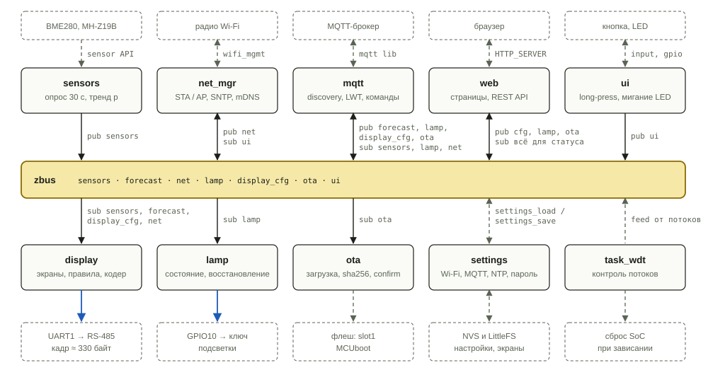
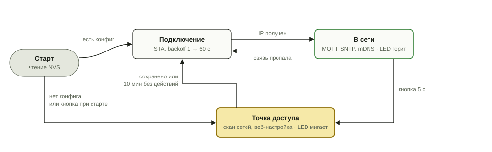
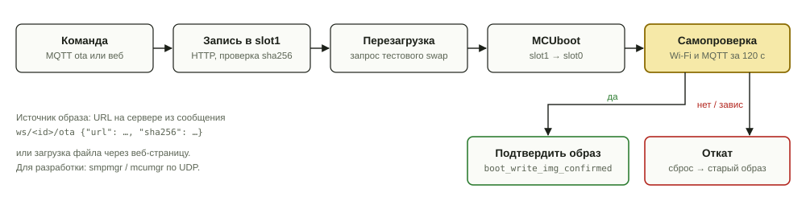
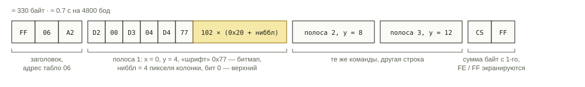

# Прошивка

Прошивка для ESP32-S3 на Zephyr. Board target — `esp32s3_devkitc/esp32s3/procpu`, распиновка задаётся в overlay (см. [`hw/`](../hw/)). Загрузчик MCUboot, сборка через sysbuild.

Порядок работ и проверки на железе — в [`docs/implementation-plan.md`](docs/implementation-plan.md), что сделано и как проверено — в [`docs/implementation-report.md`](docs/implementation-report.md). ТЗ на конструктор экранов — [`docs/screen-constructor.md`](../docs/screen-constructor.md).

## Сборка и проверка

```sh
west init -l --mf fw/west.yml weatherstation && west update && west blobs fetch hal_espressif
west build -b esp32s3_devkitc/esp32s3/procpu --sysbuild fw     # плата + MCUboot, подписанный образ
west build -b native_sim/native/64 fw -- -DEXTRA_CONF_FILE=overlay-smp.conf   # на ПК
```

Те же шаги, что в CI ([`.github/workflows/fw.yml`](../.github/workflows/fw.yml)), запускаются локально скриптами из [`scripts/`](scripts/):

| Скрипт | Что делает | Нужно |
| --- | --- | --- |
| `lint.sh [--fix]` | clang-format, сгенерированные шрифты и эталонные кадры не устарели | node, clang-format |
| `host-tests.sh` | вся логика `lib/` на ПК с ASan/UBSan за секунды | cmake, ninja, gcc/g++ |
| `unit.sh`, `golden.sh` | те же наборы ztest под twister на `native_sim`, покрытие | west, Zephyr SDK |
| `integration.sh` | прошивка на `native_sim` + pytest: табло, датчики, NTP, MQTT, METAR, OTA | west, Mosquitto на 1883 |
| `web.sh [--mock]` | рендерер в node, Playwright против макета и против `native_sim` | node, playwright |
| `build-target.sh` | ESP32-S3 + MCUboot, `merged.bin`, подписанный образ, отчёт размеров | west, SDK, blobs |

Проверки на плате H1–H19 — `fw/tests/hw` под `west twister --device-testing` (см. [`testcase.yaml`](testcase.yaml)).

| Каталог | Содержимое |
| --- | --- |
| `lib/` | вся логика на чистом C без Zephyr: табло, JSON, переменные, компилятор экранов, правила, датчики, сеть, время, HA, настройки, METAR, OTA |
| `src/` | сервисы Zephyr — только связка `lib/` с драйверами, zbus, сетью и оболочкой |
| `emul/` | эмуляторы BME280, MH-Z19B и снифер табло для `native_sim` |
| `web/` | веб-страница (без сборки, gzip в прошивке) и её тесты |
| `tests/` | `lib/` — ztest, `host/` — запуск ztest на ПК, `integration/`, `web/`, `hw/` — pytest |
| `boards/`, `sysbuild/`, `keys/` | overlay, разметка флеша, MCUboot, **тестовый** ключ подписи |

## Блоки



Модули не вызывают друг друга напрямую, а обмениваются через каналы zbus. Например, MQTT кладёт прогноз в канал `forecast`, а табло и веб-страница читают его каждый сам. Поэтому любой модуль можно отключить или отладить отдельно, а веб-страница показывает то же состояние, что и табло.

| Модуль | Исполнение | Период или событие | Подсистемы Zephyr |
| --- | --- | --- | --- |
| sensors | поток, низкий приоритет | 30 с | `bosch,bme280`, `winsen,mhz19b` (на `native_sim` — свои эмуляторы), кольцевой буфер давления на 3 ч |
| metar | своя очередь работ | 30 мин, после синхронизации часов | HTTP client, mbedTLS, модуль [`au/metar_cpp`](../au/) |
| net_mgr | поток + события net_mgmt | события Wi-Fi и кнопки | `wifi_mgmt`, DHCPv4 server в режиме AP, SNTP, mDNS |
| mqtt | поток с `poll()` | непрерывно, переподключение 1 → 60 с | MQTT client, LWT, retain |
| web | потоки HTTP-сервера | по запросу | `HTTP_SERVER`, статика в gzip |
| display | zbus listener + поток передачи | изменения переменных, минута | UART, кадр отдаёт отдельный поток через `uart_poll_out` |
| lamp | zbus listener | команда или кнопка | GPIO |
| ota | своя очередь работ | команда MQTT, загрузка с веб-страницы, SMP | MCUboot, `dfu/flash_img`, MCUmgr по UDP |
| watchdog | `task_wdt` | каналы потоков сети, датчиков, MQTT и системной очереди | `task_wdt`, аппаратный WDT как запасной |
| ui | input callback + автомат `lib/ui` | нажатия | `gpio-keys`; длинное нажатие и дребезг считает `lib/ui` |
| settings | библиотека | старт и изменения | `settings` поверх NVS; экраны в LittleFS |

## Wi-Fi и первичная настройка



- Точка доступа `Weatherstation-XXXX` (XXXX — конец MAC), страница настройки на `192.168.4.1`. Список сетей сканируется до запуска точки доступа и кешируется.
- Кнопка, зажатая при подаче питания, сразу включает точку доступа. Долгое нажатие (5 с) на работающем устройстве делает то же. Через 10 минут без действий устройство возвращается в сеть.
- Короткое нажатие — отладочное: листает все экраны по кругу, через 60 с без нажатий табло возвращается к выбору по правилам.
- В рабочем режиме веб-страница закрыта паролем. На ней настраиваются Wi-Fi, MQTT, NTP (два сервера, интервал, часовой пояс POSIX TZ), METAR (код ICAO станции, URL), экраны.

## Обновление по сети



Новый образ сначала запускается в тестовом режиме и подтверждает себя только после подключения к брокеру. Если этого не случилось, watchdog перезагружает плату, и MCUboot возвращает предыдущую прошивку. Для разработки — `smpmgr` / `mcumgr` по UDP.

| Раздел флеша | Размер |
| --- | --- |
| MCUboot | 64 КБ |
| slot0, рабочий образ | 4 МБ |
| slot1, новый образ | 4 МБ |
| NVS, настройки | 64 КБ |
| LittleFS, экраны и пиктограммы | 1 МБ |
| свободно | ≈ 6.9 МБ |

## MQTT и Home Assistant

| Топик | Направление | Содержимое | Retain |
| --- | --- | --- | --- |
| `ws/<id>/status` | ESP → | `online`, при обрыве брокер публикует `offline` (LWT) | да |
| `ws/<id>/sensors` | ESP → | `{t, rh, p, ptrend, co2, rssi}` раз в 30 с | нет |
| `ws/<id>/lamp/set` | → ESP | `ON` / `OFF` | нет |
| `ws/<id>/lamp/state` | ESP → | фактическое состояние ключа | да |
| `ws/<id>/forecast` | сервер → ESP | готовый прогноз, см. ниже | да |
| `ws/<id>/display/state` | ESP → | `{screen, name, reason, pinned}` при каждой смене экрана | да |
| `ws/<id>/display/pin` | → ESP | `{screen, minutes}` или `auto` | нет |
| `ws/<id>/display/cfg` | ESP → | конфигурация экранов после сохранения, резервная копия | да |
| `ws/<id>/display/cfg/set` | → ESP | конфигурация экранов, та же проверка, что через веб | нет |
| `ws/<id>/ota` | → ESP | `{url, sha256, version}` | нет |
| `homeassistant/…/config` | ESP → | discovery | да |

В Home Assistant появляется устройство «Метеостанция»: температура, влажность, давление, CO2, свет «Подсветка табло», `select` «Экран табло» с вариантом «Авто».

Прогноз от сервера:

```json
{
  "ts":    1790884800,
  "now":   { "t": -2, "cond": "pcloud", "wind": 5, "dir": "nw", "rh": 78, "p": 748 },
  "day":   { "max": 4, "min": -7 },
  "rain":  { "from": 15, "to": 19 },
  "flags": { "snow": false, "ice": true, "storm": false },
  "next":  { "name": "ночь", "t": -7, "cond": "night" },
  "src":   { "now.t": "metar", "rain": "taf", "flags.ice": "derive" }
}
```

Если прогноз старше 2 часов, а сводка METAR свежая, `out.*` и признак гололёда берутся из METAR, который ESP запрашивает сама.

## Табло


Экран собирается в веб-конструкторе из элементов (температура, иконка, осадки, ветер, давление, CO2, график, часы, пиктограммы) в крупной (высота 11) или мелкой (высота 5) форме. Элемент может иметь условие показа и варианты подмены: например, при гололёде вместо иконки погоды рисуется «машина юзом». У экрана есть правило: условие по переменным, окно времени, приоритет, гистерезис и минимальное время показа. Если ни одно правило не сработало, показывается экран по умолчанию.


JSON с экранами разбирается только при старте и сохранении, в работе используются готовые структуры. Кадр сравнивается с предыдущим и отправляется сразу при изменении, а без изменений повторяется раз в 30 с — чтобы табло восстанавливалось после пропадания питания.



Формат взят из [`legacy/rpi/scripts/futaba.py`](../legacy/rpi/scripts/futaba.py). Встроенные шрифты табло не используются: весь экран передаётся тремя битмап-полосами через «шрифт» 0x77. Свои шрифты (цифры 6×11, мелкий 3×5) и иконки генерируются в C-заголовок из тех же описаний глифов, что в [симуляторе](../tools/sign-simulator/).

## Консоль и REST API

Команды оболочки (UART на плате, stdin/stdout на `native_sim`) — те же, что используют тесты:

| Команда | Назначение |
| --- | --- |
| `ws status`, `ws vars`, `ws var set/clear` | состояние, переменные, подмена значения |
| `ws sign pattern/show/stats/frame` | тестовые кадры, закрепить экран, статистика перекладки |
| `ws sensors [read]`, `ws lamp [on/off]`, `ws led` | датчики и ввод-вывод |
| `ws net`, `ws ap`, `ws ntp`, `ws time set`, `ws mqtt [publish]` | сеть, время, брокер |
| `ws set <ключ> <значение>`, `ws settings`, `ws cfg status/factory/rollback` | настройки и набор экранов |
| `ws metar fetch/status/parse` | резерв METAR, разбор сводки без сети |
| `ws ota status/get/selftest`, `ws wdt status/hang` | обновление, самопроверка, проверка watchdog |

REST API веб-страницы: `/api/status`, `/api/screens` (GET/PUT, `validate`, `rollback`, `factory`), `/api/catalog`, `/api/glyphs`, `/api/vars`, `/api/render`, `/api/display/{state,preview,pin}`, `/api/settings`, `/api/wifi/scan`, `/api/lamp`, `/api/ota`, `/api/ota/upload`. Запросы к API требуют Basic Auth, когда задан пароль; в режиме точки доступа страница открыта.

## Порядок работы

1. Окружение: west, сборка, прошивка по USB, консоль, отладка через OpenOCD по USB-JTAG.
2. Табло: overlay с UART1, кодер Mobitec, тестовый кадр.
3. Датчики, кнопка, светодиод, подсветка.
4. Wi-Fi, MQTT, Home Assistant discovery.
5. Конструктор экранов: переменные, элементы, зоны, правила, API, веб-редактор.
6. Точка доступа и веб-настройка.
7. MCUboot и OTA.
8. Резерв METAR.
