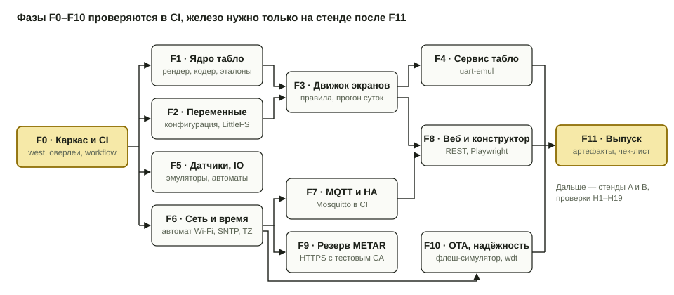
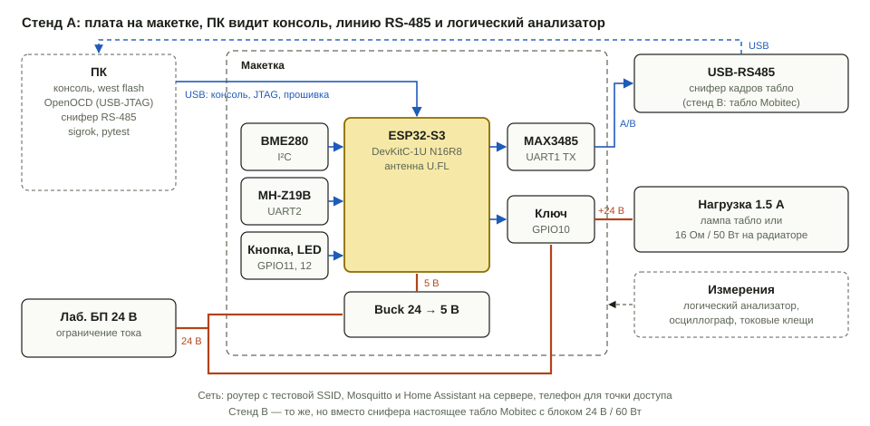

# План реализации прошивки

Прошивка пишется так, чтобы почти всё проверялось без железа: в GitHub Actions на `native_sim` и обычными unit-тестами. Железо нужно только для того, что нельзя честно сымитировать: радио, реальные датчики, электрика табло и подсветки, загрузчик на флеше.

Основа — Zephyr 4.3, как в ветке `esp32/dev`. Цель — `esp32s3_devkitc/esp32s3/procpu`. Архитектура описана в [`fw/README.md`](../README.md), конструктор экранов — в [`docs/screen-constructor.md`](../../docs/screen-constructor.md).

## Как устроена проверка без железа

Код делится на три слоя, и каждый проверяется своим способом.

| Слой | Что в нём | Где живёт | Чем проверяется |
| --- | --- | --- | --- |
| Логика | Шрифты, рендер, кодер Mobitec, переменные, правила, разбор JSON, автоматы Wi-Fi, кнопки и OTA, расчёт солнца, разбор POSIX TZ, отображение METAR | `fw/lib/` — чистый C без зависимостей от Zephyr | ztest на `native_sim/native/64`, эталонные кадры из `tools/sign-simulator/core.js` |
| Сервисы | Потоки, zbus, драйверы, сеть, HTTP, MQTT, хранение | `fw/src/` | `native_sim` с эмуляторами: `uart-emul`, `gpio-emul`, I²C-эмулятор, симулятор флеша, сокеты хоста (NSOS) |
| Железо | Wi-Fi ESP32, MCUboot на флеше, электрика | только сборка под ESP32-S3 | сборка в CI, проверка на стенде |

Правило: всё, что принимает решения, живёт в `fw/lib/` и тестируется без Zephyr-сервисов. Сервисы в `fw/src/` только связывают логику с вводом-выводом. Тогда на железе остаётся проверять ввод-вывод, а не алгоритмы.

Для каждого сервиса есть команды Zephyr shell (`ws sign …`, `ws lamp …`, `ws sensors`, `ws mqtt …`). На `native_sim` их вызывают тесты, на стенде — человек или тот же pytest через `twister --device-testing`.

### Задачи CI

| Задача | Что делает | Блокирует слияние |
| --- | --- | --- |
| `lint` | clang-format, проверка, что сгенерированные шрифты совпадают с `core.js` | да |
| `unit` | `twister -p native_sim/native/64 -T fw/tests` — все ztest, отчёт покрытия gcov | да |
| `golden` | Node рисует эталонные кадры в `core.js`, ztest сравнивает их с C-рендером побайтно | да |
| `integration` | `native_sim` + Mosquitto в service container + pytest: MQTT, HTTP API, METAR по HTTPS с тестовым CA, NTP | да |
| `web` | Node-тесты JS-части конструктора, Playwright против веб-сервера на `native_sim` | да |
| `target` | сборка `esp32s3_devkitc/esp32s3/procpu` с sysbuild и MCUboot, подпись образа, отчёт ROM/RAM, артефакты | да |
| `size` | сравнение размеров с бюджетом из `fw/size-budget.json` | предупреждение |

Среда — `zephyrproject-rtos/action-zephyr-setup` с кэшем west и SDK. Тулчейн нужен только `xtensa-espressif_esp32s3_zephyr-elf`; `native_sim` собирается хостовым gcc.

## Фазы без железа

У каждой фазы — что делается, чем проверяется и когда она считается готовой. Фаза готова, когда её тесты проходят в CI и ничего из предыдущих фаз не сломано.

### F0. Каркас и CI

- `fw/` — приложение Zephyr: `west.yml` с Zephyr v4.3.0 и только нужными модулями (`hal_espressif`, `mbedtls`, `mcuboot`, `littlefs`), `CMakeLists.txt`, `Kconfig`, `prj.conf`.
- Оверлеи: `boards/esp32s3_devkitc_procpu.overlay` с распиновкой из [`hw/`](../../hw/), разметкой флеша (MCUboot 64 КБ, slot0 и slot1 по 4 МБ, NVS 64 КБ, LittleFS 1 МБ); `boards/native_sim.overlay` с эмуляторами тех же узлов под теми же алиасами.
- `sysbuild.conf` с MCUboot, ключ подписи для разработки (боевой ключ не в репозитории).
- Модуль `au/metar_cpp` подключается как модуль Zephyr через обёртку `fw/modules/metar_cpp/zephyr/module.yml`.
- Из `esp32/dev` переносятся настройки сети и NVS, адаптированные под S3.
- Workflow `.github/workflows/fw.yml` со всеми задачами из таблицы выше, пока на пустых тестах.

**Готово, когда** CI зелёный: прошивка собирается под ESP32-S3 с MCUboot и под `native_sim`, пустой ztest проходит.

### F1. Ядро табло

- `fw/lib/sign/`: кадровый буфер 102×11, рисование глифов, кодер Mobitec (`FF 06 A2`, три полосы `D2/D3/D4 77`, контрольная сумма с экранированием FE/FF), сравнение кадров со счётом перевёрнутых точек и столбцов.
- `tools/glyphgen`: генерирует `fw/lib/sign/glyphs_gen.h` из `core.js` — цифры 6×11, мелкий шрифт 3×5 с кириллицей, иконки 11×11 и 5×5, пиктограммы.
- Эталоны: скрипт на Node рисует в `core.js` набор сценариев (все цифры, отрицательные температуры, все иконки, все виджеты) и сохраняет кадры и байты Mobitec в `fw/tests/golden/*.json`.

**Тесты:** кодер на кадрах из `legacy/rpi/scripts/futaba.py`, побайтное совпадение с эталонами, крайние случаи контрольной суммы (FE и FF), отсечение глифов по краю холста.

**Готово, когда** C-рендер и `core.js` дают одинаковые кадры на всём эталонном наборе.

### F2. Переменные и конфигурация

- `fw/lib/vars/`: таблица переменных из раздела 3 ТЗ с типами, временем обновления, сроком жизни и признаком «неизвестно»; внешние `ext.1…8`; подмена `out.*` на `obs.*` при устаревшем прогнозе.
- `fw/lib/config/`: разбор JSON экранов (схема 1), проверка с путём ошибки (`screens[1].items[3]: перекрывает items[2]`), компиляция в структуры, лимиты из раздела 8. Пиктограммы пользователя (`pictos`).
- Хранение: LittleFS, `screens.json` и `screens.prev.json`, заводской набор вшит в прошивку; порядок загрузки «текущий → предыдущий → заводской».
- Разбор прогноза из MQTT (`now`, `day`, `rain`, `flags`, `next`, `src`) в переменные.

**Тесты:** корректные и испорченные конфигурации (обрезанный JSON, перекрытие рамок, неизвестная переменная, два экрана по умолчанию, превышение лимитов), круговой тест «JSON → структуры → JSON», запуск с битым файлом на симуляторе флеша.

**Готово, когда** любая некорректная конфигурация отклоняется с понятной ошибкой, а устройство на `native_sim` поднимается с испорченным файлом.

### F3. Движок экранов

- `fw/lib/screens/`: все элементы каталога в формах L, S, S2; рамка, выравнивание, «--» для неизвестного значения; условия и варианты подмены; зоны ротации по часам с пропуском пустых элементов.
- Правила: сравнения с гистерезисом, окна времени через полночь, приоритеты, задержки включения и выключения, минимальное время показа, режим вставки, закрепление вручную, отладочное листание кнопкой. Причина выбора — строкой.
- Заводской набор из раздела 12 ТЗ.

**Тесты:** табличные тесты на каждое правило; дребезг CO2 980–1020 ppm не переключает экран; прогон суток с шагом 10 с на записанных прогнозах (сухой день, дождь в 15:00, гололёд ночью, сервер пропал) со сверкой ожидаемой последовательности экранов; эталонные кадры каждого заводского экрана.

**Готово, когда** прогон суток даёт ожидаемую последовательность экранов, а число перевёрнутых точек за сутки укладывается в бюджет.

### F4. Сервис табло

- `fw/src/display/`: `k_work_delayable` раз в 10 с и по событию zbus, рендер, отправка через UART async, повтор кадра раз в 30 с, статистика перевёрнутых точек, канал `display_state`.
- Команды `ws sign pattern <checker|columns|rows|all|none>`, `ws sign show <screen>`, `ws sign stats`.

**Тесты (`native_sim`):** UART1 подключён к `uart-emul`; тест читает байты, декодирует кадр и сравнивает с ожидаемым экраном; проверяет повтор раз в 30 с и что при неизменных данных байты не меняются.

**Готово, когда** на `native_sim` при подмене переменных через shell табло в эмуляторе показывает нужные экраны.

### F5. Датчики и ввод-вывод

- `fw/src/sensors/`: BME280 и MH-Z19B через sensor API, опрос 30 с, кольцевой буфер давления на 3 ч, тренд.
- `fw/src/io/`: ключ подсветки (GPIO, восстановление после перезагрузки по настройке), кнопка через `gpio-keys` и `zephyr,input-longpress` (короткое, долгое, зажата при старте), светодиод с шаблонами мигания.
- Логика кнопки и светодиода — в `fw/lib/ui/` как автоматы.
- Команды `ws sensors`, `ws lamp on|off`, `ws led <pattern>`.

**Тесты:** на `native_sim` — I²C-эмулятор BME280 (если готового в Zephyr нет, свой на `i2c-emul`), эмулятор MH-Z19B на `uart-emul` (ответ на команду `0x86` с контрольной суммой), `gpio-emul` для кнопки, светодиода и ключа. Unit-тесты автоматов кнопки и тренда давления.

**Готово, когда** на `native_sim` нажатия, эмулированные через `gpio-emul`, дают правильные события, а показания эмуляторов доходят до переменных и MQTT.

### F6. Сеть и время

- `fw/lib/net/`: автомат STA ↔ AP из `fw/README.md` (события на входе, действия на выходе), отсрочка переподключения 1 → 60 с, возврат из AP через 10 минут.
- `fw/src/net/`: адаптер Wi-Fi для ESP32 (только сборка в CI); на `native_sim` вместо Wi-Fi — сокеты хоста (NSOS), сеть считается подключённой.
- SNTP с двумя серверами и интервалом, свой разбор строки POSIX TZ (базы часовых поясов на устройстве нет), расчёт `sun.up` по координатам, mDNS `weatherstation.local`.
- Настройки сети в NVS через `settings`.

**Тесты:** unit-тесты автомата на сценариях (нет конфига, кнопка при старте, пропадание сети, 10 минут в AP); разбор TZ (`MSK-3`, `CET-1CEST,M3.5.0,M10.5.0/3`); восход и закат по эталонным таблицам; на `native_sim` — SNTP против локального NTP-сервера на Python в pytest.

**Готово, когда** автомат проходит все сценарии, а на `native_sim` время приходит с тестового NTP.

### F7. MQTT и Home Assistant

- `fw/src/mqtt/`: подключение, переподключение, LWT, публикации из раздела MQTT в `fw/README.md`, подписки на `lamp/set`, `forecast`, `display/pin`, `display/cfg/set`, `ota`.
- Discovery: сенсоры, свет, `select` экрана, диагностика; переиздание при сохранении экранов.
- Формирование JSON discovery — в `fw/lib/ha/`, чтобы проверять без брокера.

**Тесты:** unit-тесты JSON discovery по образцам; интеграционные — `native_sim` и Mosquitto в CI, pytest с paho: появление discovery, LWT при убийстве процесса, `lamp/set` → GPIO в эмуляторе, retain-прогноз → смена экрана в эмуляторе UART.

**Готово, когда** pytest проходит весь сценарий «включили → discovery → прогноз → экран → лампа → обрыв → offline».

### F8. Веб и конструктор экранов

- `fw/src/web/`: HTTP-сервер, Basic Auth с хэшем пароля, статика в gzip, REST из раздела 10 ТЗ, настройки Wi-Fi, MQTT, NTP, METAR, сканирование сетей (на `native_sim` — заглушка со списком).
- `fw/web/`: страницы без фреймворков — список экранов, редактор с перетаскиванием, редактор правил, симулятор с прогоном суток, редактор пиктограмм, настройки. Рендер в браузере берёт шрифты из `/api/glyphs`.
- Сборка веба в `fw/web/dist` и упаковка в прошивку как gzip-ресурсы; бюджет 80 КБ.

**Тесты:** Node-тесты JS-рендера на тех же эталонах, что и C; pytest для REST (валидация, откат, авторизация); Playwright против `native_sim`: собрать экран перетаскиванием, сохранить, увидеть новый кадр в эмуляторе UART.

**Готово, когда** Playwright собирает и применяет экран, а `/api/render` совпадает с предпросмотром в браузере.

### F9. Резерв METAR

- `fw/src/metar/`: запрос раз в 30 мин по HTTPS с проверкой сертификата, основной и запасной URL, разбор `metar_cpp`, переменные `obs.*`, правило подмены.
- Отображение сводки в переменные (`obs.cond`, `obs.ice`, QFE в мм рт. ст.) — в `fw/lib/metar_map/`.

**Тесты:** unit-тесты отображения на наборе реальных сводок (FZRA, RERA при минусе, R88/79…, CAVOK, ночь); на `native_sim` — HTTPS-сервер в pytest с тестовым CA, проверка отказа при чужом сертификате и переключения на запасной URL.

**Готово, когда** при остановленном брокере экран на `native_sim` переходит на данные METAR, а при устаревшем METAR — на «Нет прогноза».

### F10. OTA и надёжность

- `fw/lib/ota/`: автомат «загрузка → проверка sha256 → перезагрузка → самопроверка 120 с → подтверждение или откат».
- `fw/src/ota/`: загрузка по HTTP в slot1 через `dfu/img_util`, команда по MQTT и загрузка через веб, MCUmgr по UDP, task watchdog на всех потоках.
- Сборка под ESP32-S3 с sysbuild, подписанный образ для OTA как артефакт CI.

**Тесты:** unit-тесты автомата; на `native_sim` — загрузка образа в раздел симулятора флеша с проверкой sha256 и отказом при несовпадении; watchdog срабатывает на зависший поток (тестовая команда); `smpmgr` загружает образ по UDP.

**Готово, когда** всё, кроме реальной перестановки слотов, проверено на `native_sim`, а подписанный образ собирается в CI.

### F11. Выпуск

- Артефакты CI: `merged.bin` для первой прошивки по USB, подписанный образ для OTA, отчёт размеров, отчёт покрытия.
- Обновление `fw/README.md` и раздела «Состояние» в корневом README.
- Чек-лист проверки на стенде из этого документа.

## Проверки на железе

Всё ниже — то, что CI проверить не может. Для каждой проверки в прошивке уже есть команда shell, а там, где это имеет смысл, — pytest-тест, который на стенде запускается через `twister --device-testing --device-serial /dev/ttyACM0`.

### Стенд A — макетка на столе

| Узел | Что | Зачем |
| --- | --- | --- |
| Плата | ESP32-S3-DevKitC-1U N16R8 на макетке, антенна через pigtail | объект проверки |
| ПК | USB к порту USB платы: консоль, прошивка, USB-JTAG (OpenOCD) | управление, логи, отладка |
| Питание | Лабораторный БП 24 В с ограничением тока, buck 24 → 5 В | питание как в изделии, измерение токов |
| Датчики | BME280 и MH-Z19B на модулях; эталонный термогигрометр рядом | сверка показаний |
| RS-485 | MAX3485, линия A/B на USB-RS485 адаптер ПК; терминатор 120 Ом | снифер кадров табло без самого табло |
| Подсветка | Ключ подсветки, нагрузка — лампа табло или резистор 16 Ом / 50 Вт на радиаторе (≈ 1.5 А при 24 В) | ток, нагрев, бросок |
| Кнопка и LED | Как на корпусе | сервисный режим |
| Логический анализатор | 8 каналов (sigrok-совместимый): UART1 TX, UART2 TX/RX, SDA/SCL, затвор ключа | временные диаграммы |
| Осциллограф | Пульсации 5 В, бросок тока лампы (токовые клещи или шунт) | электрика |
| Сеть | Роутер с тестовой SSID в VLAN умного дома, Mosquitto и Home Assistant на сервере, телефон | Wi-Fi, точка доступа, MQTT |

### Стенд B — табло

Стенд A, к которому вместо снифера подключено настоящее табло Mobitec с его блоком питания 24 В / 60 Вт и лампой. Плюс токовые клещи на шине 24 В и термометр внутри корпуса. На этом же стенде идёт длительный прогон.

### Проверки

| № | Что проверяем | Стенд | Как | Критерий |
| --- | --- | --- | --- | --- |
| H1 | Прошивка и отладка | A | `west flash` по USB, консоль, OpenOCD: остановка, шаг, точка останова | загрузка из MCUboot, разметка флеша как в overlay |
| H2 | Память модуля | A | лог старта: ID флеша, PSRAM, `kernel stacks`, свободная куча | 16 МБ флеша видны, запас стеков ≥ 25 % |
| H3 | Кадр на линии RS-485 | A | `ws sign pattern …`, снифер на ПК декодирует кадры тем же кодом, что в тестах | байты совпадают с эталоном, 4800 8N1, кадр ≈ 0.7 с |
| H4 | Кадр на табло | B | шахматка, столбцы, строки, все экраны заводского набора | ориентация и порядок бит верны, при повторе кадра точки не шуршат |
| H5 | Тихая смена зон | B | 30 мин в рабочем режиме, `ws sign stats` | перекладываются только зоны, 20–30 столбцов за раз |
| H6 | BME280 | A, B | сравнение с эталоном 1 ч на столе, затем в закрытом корпусе | расхождение после поправки ≤ 0.5 °C и ≤ 5 % RH; поправка записана в настройки |
| H7 | MH-Z19B | A | прогрев 3 мин, проветривание до уличного воздуха | ~420 ppm на улице, устойчивое чтение, нет ошибок контрольной суммы |
| H8 | Ключ подсветки | A, B | включение и выключение под нагрузкой 1.5 А, клещи на 24 В, термопара на транзисторе | бросок не роняет 5 В, нагрев транзистора за 1 ч ≤ 30 °C над окружающей |
| H9 | Лампа при старте | A | осциллограф на затворе при подаче питания, прошивке и сбросе | ключ не открывается ни на одном переходе |
| H10 | Кнопка и LED | A | зажата при старте, долгое 5 с, короткие нажатия | точка доступа, листание экранов, дребезг не даёт двойных срабатываний |
| H11 | Питание | A, B | пульсации 5 В при передаче Wi-Fi, пиковый ток 24 В при массовой перекладке табло и включённой лампе | нет просадок и перезагрузок, пик в пределах 60 Вт |
| H12 | Wi-Fi STA | B | подключение, перезагрузка роутера, RSSI в закрытом корпусе с внешней антенной | переподключение без вмешательства, RSSI лучше −75 дБм |
| H13 | Точка доступа | A | вход с телефона, список сетей, сохранение, возврат в сеть; поведение сканирования в режиме AP+STA | список сетей виден, после сохранения станция в сети |
| H14 | NTP и HTTPS | A | NTP с указанного сервера, METAR с реальных адресов | время верное, цепочка сертификатов принимается |
| H15 | MQTT и Home Assistant | B | discovery, подсветка из HA, выбор экрана в HA | сущности появились, команды выполняются за 1 с |
| H16 | OTA | A | обновление по MQTT; обрыв питания во время загрузки; образ, который не подключается к брокеру; загрузка через `smpmgr` | после обрыва работает старый образ, плохой образ откатывается |
| H17 | Watchdog | A | тестовая команда, вешающая поток | сброс, после сброса устройство в сети |
| H18 | Помехи | B | многократное включение лампы при работающем табло и датчиках | нет сбоев кадров и ошибок чтения датчиков |
| H19 | Длительный прогон | B | 72 ч в рабочем режиме | нет утечек памяти, все переподключения автоматические, экраны соответствуют правилам |

## Открытые вопросы для реализации

- Есть ли в Zephyr 4.3 эмулятор BME280 и в каком виде; если нет — свой на `i2c-emul`.
- Поддерживает ли драйвер Wi-Fi ESP32 сканирование в режиме AP+STA; обходной путь со списком, снятым до запуска AP, заложен в F6, проверка — H13.
- Как выглядит MCUboot для ESP32-S3 в Zephyr 4.3 с sysbuild: проверяется сборкой в F0, загрузка — H1 и H16.
