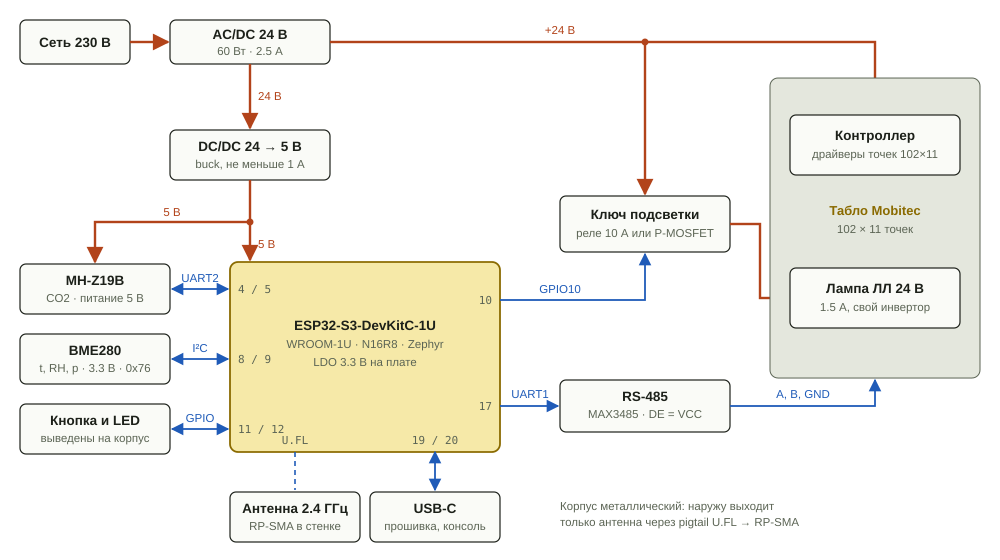
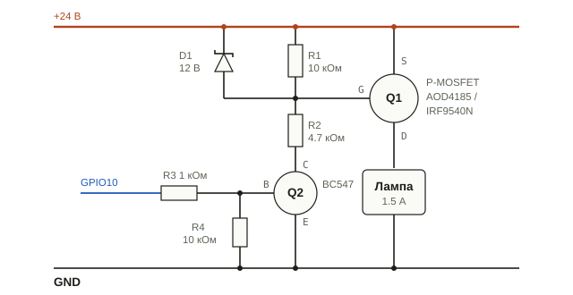

# Аппаратная часть

Всё питается от одного блока питания 24 В / 60 Вт: контроллер табло напрямую, лампа подсветки через ключ, ESP32-S3 через понижающий преобразователь на 5 В. Табло только принимает данные по RS-485. Первая версия собирается на макетке из готовых модулей.

Цифры внутри платы — номера GPIO. Корпус металлический, наружу выходит только антенна.

## Блоки

| Блок | Модуль | Связь с ESP32-S3 | Питание |
| --- | --- | --- | --- |
| Контроллер | ESP32-S3-DevKitC-1U N16R8 (WROOM-1U) | — | 5 В, LDO 3.3 В на плате |
| Табло | Mobitec 102×11, свой контроллер драйверов | UART1 → RS-485, 4800 8N1, только передача | 24 В |
| Подсветка | Люминесцентная лампа 24 В / 1.5 А со своим инвертором | GPIO10 → ключ в разрыве +24 В | 24 В |
| CO2 | MH-Z19B | UART2, 9600 8N1 | 5 В |
| Температура, влажность, давление | BME280, адрес 0x76 | I²C | 3.3 В |
| Сервис | Кнопка и светодиод на корпусе | GPIO11, GPIO12 | 3.3 В |
| Связь | Антенна 2.4 ГГц, pigtail U.FL → RP-SMA | U.FL на модуле | — |
| Прошивка, консоль, отладка | USB-C платы, встроенный USB-JTAG | GPIO19/20 | — |

## Распиновка ESP32-S3

У модуля N16R8 с octal PSRAM заняты GPIO 33–37, на 26–32 висит флеш. Strapping-пины 0, 3, 45, 46 не используются. Отладка идёт через встроенный USB-JTAG, поэтому JTAG-пины 39–42 свободны.

| Сигнал | GPIO | Подключение | Примечание |
| --- | --- | --- | --- |
| UART1 TX | 17 | RS-485 DI | 4800 8N1 |
| UART1 RX | 18 | RS-485 RO | резерв, табло ничего не отвечает |
| RS-485 DE/RE | — | перемычка на VCC | GPIO16 в резерве, если понадобится приём |
| UART2 TX | 4 | MH-Z19B RX | уровни 3.3 В совместимы |
| UART2 RX | 5 | MH-Z19B TX | |
| I²C SDA / SCL | 8 / 9 | BME280 | подтяжки на модуле |
| Ключ подсветки | 10 | база NPN через 1 кОм | 10 кОм с базы на GND: при загрузке лампа выключена |
| Кнопка | 11 | на GND | внутренняя подтяжка + 100 нФ |
| Светодиод статуса | 12 | через 330 Ом на GND | выведен на корпус |
| AM2301 | 7 | DATA, 4.7 кОм на 3.3 В | резерв под уличный датчик |
| USB D− / D+ | 19 / 20 | USB-C | прошивка, консоль, USB-JTAG |
| RGB LED платы | 38 или 48 | на плате | зависит от ревизии, внутри корпуса не виден |

## Ключ подсветки

Бесшумный вариант — P-MOSFET в плюсе питания лампы. Когда Q2 открыт, R2 тянет затвор вниз, а стабилитрон D1 ограничивает Vgs до 12 В: 24 В больше допустимых для затвора 20 В. Когда Q2 закрыт, R1 запирает Q1. R4 держит лампу выключенной, пока GPIO при загрузке висит в воздухе.

Вариант с реле устроен так же: катушка 24 В в коллекторе Q2, диод 1N4007 параллельно катушке. Контакты нужны на 10 А / 30 В DC из-за броска тока при запуске инвертора лампы.

## Питание

| Потребитель | Шина | Средний ток | Пиковый ток | На шине 24 В |
| --- | --- | --- | --- | --- |
| Лампа подсветки | 24 В | 1.5 А | бросок при старте | 36 Вт |
| ESP32-S3 + Wi-Fi | 3.3 В от LDO платы | ~100 мА | ~350 мА | ≈ 1 Вт средн., ≈ 3 Вт пик на всю сторону 5 В |
| MH-Z19B | 5 В | < 60 мА | 150 мА | |
| BME280, RS-485 | 3.3 В | единицы мА | ~30 мА при передаче | |
| Контроллер табло | 24 В | не измерен | импульсы на катушки | ~20 Вт в запасе |

Сторона ESP потребляет меньше Raspberry Pi, которая уже работала от этого же блока. Конденсаторы: 470 мкФ на входе 5 В платы, 100 мкФ у MH-Z19B, потому что лампа датчика потребляет импульсами.

## Модули для макетки

| Модуль | Зачем | Обратить внимание |
| --- | --- | --- |
| ESP32-S3-DevKitC-1U N16R8 | контроллер | разъём U.FL под внешнюю антенну |
| Pigtail U.FL → RP-SMA ≤ 15 см, антенна 2.4 ГГц | связь из металлического корпуса | U.FL рассчитан на небольшое число подключений |
| Buck 24 → 5 В, от 1 А | питание платы и MH-Z19B | входное напряжение с запасом выше 24 В |
| RS-485 на MAX3485 / SP3485 | линия к табло | питание 3.3 В; у 5-вольтового MAX485 выход RO нельзя заводить в ESP |
| BME280 | t, RH, p | под видом BME280 продают BMP280 без влажности: ID чипа 0x60, а не 0x58 |
| MH-Z19B | CO2 | питание 5 В, вывод HD не подключать, прогрев 3 мин |
| P-MOSFET + BC547 + стабилитрон 12 В, или реле 24 В на 10 А + 1N4007 | ключ подсветки | см. схему выше |
| Кнопка, светодиод, 330 Ом | сервисный режим и статус | на корпус |
| 470 мкФ, 100 мкФ, 120 Ом | фильтр питания, терминатор | 120 Ом только если в табло нет своего терминатора |

## Что ещё измерить

- Пиковый ток контроллера табло при массовой перекладке точек — подтвердить запас блока питания.
- Есть ли в табло свой терминатор линии RS-485.
